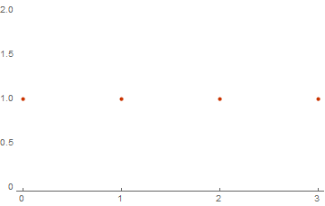

# Other Solutions

## Manual calculations of the spectrum

You have the simple list of basic vectors: 

```mathematica
basic = {{0, 1, 1}, {1, 1, 1}}; 
Dimensions[basic]

(* Out[..] = {2, 3} *)
```

How to calculate the weight spectrum of this?  
First, you should to create all linear combinations of basic vectors.  
You should to sum binary vectors:  

```
{1} + {1} => {0}  
{1} + {0} => {1}  
{0} + {0} => {0}  
```

The equivalent of this in Wolfram Language is: 

```mathematica
binAdd[vectors__] := Mod[Plus@@{vectors}, 2]&; 

vectors = {
    binAdd[{0}, {0}] , 
    binAdd[{0}, {1}] , 
    binAdd[{1}, {1}]
} 

(* Out[..] = {{0}, {1}, {0}} *) 
```

And for our basics vectors we have: 

```mathematica
linearcombination[1] = Mod[0 * basic[[1]] + 0 * basic[[2]], 2]; 
linearcombination[2] = Mod[0 * basic[[1]] + 1 * basic[[2]], 2]; 
linearcombination[3] = Mod[1 * basic[[1]] + 0 * basic[[2]], 2]; 
linearcombination[4] = Mod[1 * basic[[1]] + 1 * basic[[2]], 2]; 

Table[linearcombination[i], {i, 1, 4}] // TableForm 

(*
    0   0   0
    1   1   1
    0   1   1
    1   0   0
*)
```

Cool! We found all linear combinations for basic vectors.  
Now you should to calculate the spectrum of this.  
Is so easy! Only need to calculate the sum of all elements in the result vectors: 

```mathematica
weights = Table[Total[linearcombination[i]], {i, 1, 4}]; 
Print[weights]

(* Out[..] = {0, 3, 2, 1} *)  
```

And the count of the some element of the `weights` is the frequency this weight.  
And the Weight Spectrum is the dependency of the frequency from the weight.  

```mathematica
spectrum = Tally[weights]; 
Print[spectrum]; 
ListPlot[spectrum, PlotTheme -> "Web"] 

(* Out[..] = {{0, 1}, {3, 1}, {2, 1}, {1, 1}} *) 
```


## Easy Solution

So, lets try to automate all previous manual calculations.  
As result we must create a Mathematica function that will be  
calculate weight spectrum. Now we have a simple list of basic vectors: 

```mathematica
basic = {{0, 1, 1}, {1, 1, 1}, {1, 0, 0}, {0, 0, 0}}; 
```

First, we should create function for calculation binary sum of vectors

```mathematica
binadd[v1_, v2_] := Mod[v1 + v2, 2]; 
binadd[v1_, v2_, vs__] := binadd[binadd[v1, v2], vs]; 
```

Second, we have to make method for the calculation of linear combination.  
We know that the number of combinations is 2^n where n is number of basics vectors.  
And k-th coefficients for combinations: 

```mathematica
coefs[k_, n_] := IntegerDigits[k, 2, n]; 
linearcomb[basic_] := 
  Table[
    Table[
      basic[[i]] * coefs[k, Length[basic]][[i]], 
      {i, 1, Length[basic]}
    ], 
  {k, 0, 2^Length[basic] - 1}]; 
  
basic = {{1, 1}, {0, 0}}; 
combs = linearcomb[basic]

(*
  Out[..] = {
    {{0, 0}, {0, 0}}, 
    {{0, 0}, {0, 0}}, 
    {{1, 1}, {0, 0}}, 
    {{1, 1}, {0, 0}}
  }
*)
```

Now we have to add these combinations and calculate their weights.  

```mathematica
combinationsvectors[combs_] := Table[binadd@@elem, {elem, combs}]; 
linearcombs = combinationsvectors[combs]

weights[linearcombs_] := Tally[Table[Total[vector], {vector, linearcombs}]];
weights[linearcombs]

(*
  Out[..] = {{0, 0}, {0, 0}, {1, 1}, {1, 1}}
  Out[..] = {{0, 2}, {2, 2}}
*)
```
Nice! Now we should build one function for calculating of the weight spectrum

```mathematica
WeightSpectrum[basic_] := 
    Module[{result = ConstantArray[0, Dimensions[basic][[-1]]]}, 
      list = weights[combinationsvectors[linearcomb[basic]]]; 
      Do[result[[elem[[1]]]] = elem[[2]], {elem, list}]; 
      (*Return*)
      result
    ]; 
```