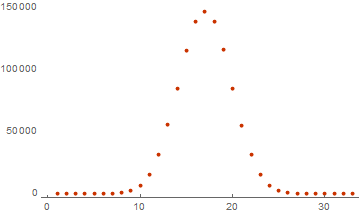

# Примеры Использования

## Инициализация
Для инициализации после установки можно выполнить следующий код:
```mathematica
Needs["WeightSpectrumLinearSubspace`"]; 
```
Если пакеты не были установлены, то для документа в этой директории необходимо выполнить:
```mathematica
Get[FileNameJoin[{
	ParentDirectory[ParentDirectory[ParentDirectory[NotebookDirectory[]]]],
	"Source", "WeightSpectrumLinearSubspace.m"
}]];
```
---

## Использование

Теперь можно попробовать вычислить какой-нибудь весовой спектр:

```mathematica
simplevectors = {{0}, {1}};
WeightSpectrumLinearSubspace[simplevectors]

(* Out[..] = {2, 2} *)
```

И для других данных:

```mathematica
list20dim32 = RandomInteger[{0, 1}, {20, 32}];
list20dim32 // Dimensions
eightoflist20dim32 = WeightSpectrumLinearSubspace[list20dim32]

(*
	Out[..] = {20, 32}
	Out[..] = {1, 0, 0, 1, 7, 48, 217, 822, 2541, 6889, 15845, 31345, 55097,
		85069, 115010, 137868, 146635, 138274, 115522, 84715, 54761, 31554,
		15845, 6830, 2583, 821, 217, 51, 7, 1, 0, 0, 0}
*)
```


Теперь построим график для распределения частоты по весу векторов:

```mathematica
ListPlot[weightoflist20dim32, PlotTheme->"Web"]
```



---

## Опции

**CompilationTarget:** имеется возможность использовать Си-компилятор для ускорения вычислений.  
Разница во времени следующая:

```mathematica
timitesttarget = RandomInteger[{0, 1}, {24, 32}];

AbsoluteTiming[WeightSpectrumLinearSubspace[timitesttarget];]
AbsoluteTiming[WeightSpectrumLinearSubspace[timitesttarget,
	  CompilationTarget -> "C"];]

(*
	Out[..] = {6.11827, Null}
	Out[..] = {3.14008, Null}
*)
```

**Listable:** по умолчанию функция не работает со списком аргументов.  
Можно использовать следующее:

```mathematica
listabletest1 = RandomInteger[{0, 1}, {20, 64}];
listabletest2 = RandomInteger[{0, 1}, {20, 64}];

listableresult1 =
	AbsoluteTiming[WeightSpectrumLinearSubspace[listabletest1]];

listableresult2 =
	AbsoluteTiming[WeightSpectrumLinearSubspace[listabletest2]];

listableresultAll =
	AbsoluteTiming[WeightSpectrumLinearSubspace[{listabletest1, listabletest2},
		Listable -> True]];

listableresult1[[1]] + listableresult2[[1]]
listableresultAll[[1]]

(*
	Out[..] = 0.964372
	Out[..] = 0.489801
*)
```

**Parallelization:** данная опция может распределять вычисления между ядрами компьютера:

```mathematica
paralleltest = RandomInteger[{0, 1}, {24, 128}];
If[Kernels[] == {}, LaunchKernels[]];

AbsoluteTiming[WeightSpectrumLinearSubspace[paralleltest];]
AbsoluteTiming[WeightSpectrumLinearSubspace[paralleltest, Parallelization -> True];]

(*
	Out[..] = {10.3901, Null}
	Out[..] = {3.43338, Null}
*)
```

---
