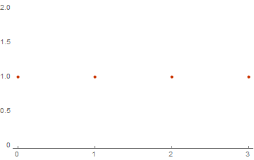

# Другие решения

## Вычисление весового спектра руками

Имеется некоторый набор бинарных векторов. 
Каждый элемент вектора может принимать значение 0 или 1. 
Набор из n векторов размерности m будем называть базисом: 

```mathematica
basic = {{0, 1, 1}, {1, 1, 1}};
Dimensions[basic]

(* Out[..] = {2, 3} *)
```

Как вычислить весовой спектр для этого базиса? 
Для начала требуется отыскать все линейные комбинации нашего базиса. 
Линейными комбинациями будем называть все возможные суммы базисных векторов умноженных на 0 или 1. 
Значение на которое умножается один из базисых векторов назовем коэффициентом линейной комбинации. 
Вектор на который умножается соответствующий ему коэффицент назовем компонентой линейной комбинации. 
Тогда сначала необходимо понять как вычисляется вектор линейной комбнации. 
Вычислить сумму двух бинарных векторов можно так: 

```
{1} + {1} => {0}  
{1} + {0} => {1}  
{0} + {0} => {0}  
```

Эквивалентную функциональность в Математике можно реализовать так: 

```mathematica
vectorAdd[vectors__] := Mod[Plus@@{vectors}, 2];

vectors = {
    vectorAdd[{0}, {0}] ,
    vectorAdd[{0}, {1}] ,
    vectorAdd[{1}, {1}]
}

(* Out[..] = {{0}, {1}, {0}} *)
```

Попробуем вычислить все возможные линейные комбинации для нашего базиса. 

```mathematica
linearcombination[1] = Mod[0 * basic[[1]] + 0 * basic[[2]], 2];
linearcombination[2] = Mod[0 * basic[[1]] + 1 * basic[[2]], 2];
linearcombination[3] = Mod[1 * basic[[1]] + 0 * basic[[2]], 2];
linearcombination[4] = Mod[1 * basic[[1]] + 1 * basic[[2]], 2];

Table[linearcombination[i], {i, 1, 4}] // TableForm

(*
    0   0   0
    1   1   1
    0   1   1
    1   0   0
*)
```

Отлично! Мы нашли все возможные линейные комбинации нашего базиса.  
Теперь мы можем вычислить сам весовой спектр для полученных векторов.  
Это очень просто! Нужно только вычислить суммы элементов каждого вектора:  

```mathematica
weights = Table[Total[linearcombination[i]], {i, 1, 4}];
Print[weights]

(* Out[..] = {0, 3, 2, 1} *)  
```

Количество встреч каждого значения в списке `weights` и есть частота некоторого веса.  
И как итог - Весовой Спектр это зависимость частоты встреч от веса.  

```mathematica
spectrum = Tally[weights];
Print[spectrum];
ListPlot[spectrum, PlotTheme -> "Web"]

(* Out[..] = {{0, 1}, {3, 1}, {2, 1}, {1, 1}} *)
```


## Простое решение

И так, давайте попробуем автоматизировать все предыдущие ручные операции. 
В качества результаты мы должны получить только одну функцию Математики, 
которая будет вычислять весовой спектр. Пусть у нас есть простой список векторов: 

```mathematica
basic = {{0, 1, 1}, {1, 1, 1}, {1, 0, 0}, {0, 0, 0}};
```

Первое, что нужно сделать - вычислить все линейные комбинации. 
Компоненты в каждой линейной комбинации - это произведение коэффициентов 
0 или 1 на один из базисных векторов. Вычислим линейные комбинации так: 

```mathematica
LinearCombinations[basic_] :=
    Table[basic * IntegerDigits[k, 2, Length[basic]],
        {k, 0, 2^Length[basic] - 1}];
```

Проверим работу этой фукции: 

```mathematica
LinearCombinations[{{0, 1}, {0, 0}}]

(*
    {{{0, 0}  {0, 0}},
    {{0, 0}  {0, 0}},
    {{0, 1}  {0, 0}},
    {{0, 1}  {0, 0}}}
*)
```

Следующим шагом необходимо полученные компоненты для комбинаций векторно сложить 
и вычислить их веса. Делается это просто: 

```mathematica
VectorWeights[combinations_] :=
    Table[Plus @@ Mod[Plus @@ elem, 2], {elem, combinations}];
```

Проверим как это работает на предыдущем результате: 

```mathematica
VectorWeights[LinearCombinations[{{0, 1}, {0, 0}}]]

(* Out[..] = {0, 0, 1, 1} *)
```

Последний шаг - просто подсчет частоты встреч некоторого веса. Сделать тоже очень легко. 
Для большего удобства можно создать список, где индекс элемента соответствует его весу + 1. 

```mathematica
WeightFrequncy[weights_, length_] :=
    Block[{spectrum = ConstantArray[0, length + 1], freq = Tally[weights]},
      Do[spectrum[[weight[[1]] + 1]] = weight[[2]], {weight, freq}];
      Return[spectrum]
    ];

WeightSpecrumLinearSubspaceEasy[basic_] :=
WeightFrequncy[VectorWeights[LinearCombinations[basic]], Dimensions[basic][[-1]]]
```

Итоговый результат - простое решение для подсчета весового спектра. 
Теперь провериv как работает это решение с увеличением объема данных. 
Создадим набор из списков базисных векторов разной длины: 

```mathematica
data =
Table[DeleteDuplicates@RandomInteger[{0, 1}, {i, i}], {i, 5, 20}];
```

Вычислим время раcсчета каждого элемента списка и построим зависимость времени 
от количества базисных векторов: 

```mathematica
timelist = Table[{Length[d],
  RepeatedTiming[ws[Length[d]] =
      WeightSpecrumLinearSubspaceEasy[d];][[1]]}, {d, data}];

ListPlot[timelist, PlotTheme -> "Web"]
```

## Оптимизированное решение  

Очевидно, что предыдущий вариант не является самым быстрым способом вычисления весового спектра. 
Требуется некоторая оптмизация. Наиболее логичным вариантом будет использование функции `Compile[]`. 
Использовать компиляцию рекомендуется во всех случаях, когда возникает необходимость в 
громоздких численных рассчетах. Вот каким образом можно создать скомпилированную функцию: 

```mathematica
WeightSpectrumLinearSubspaceSimpleComppile = 
Compile[{{basevectors, _Integer, 2}}, 
	Module[{
			n = Dimensions[basevectors][[-1]], 
			k = Length[basevectors], 
			s = Table[0, {i, 0, Dimensions[basevectors][[-1]]}] 
		}, 
		
		Do[
			With[{l = Total[Mod[Total[IntegerDigits[b, 2, k] * basevectors], 2]] + 1},  
			s[[l]] = s[[l]] + 1], 
			{b, 0, 2^k - 1}]; 
		s
	], Parallelization -> True, RuntimeOptions -> "Speed"
];
```

Что делает эта функция?  
1. Сначала вычисляется размерность векторов и их количество - n и k соответственно.  
2. Потом создается результирующий список, который содержит количество всех векторов с 
определенным весом и заполняется нулями. Индекс в списке - это и есть вес вектора, 
значение элемента по индексу - есть количество векторов с весом равным индексу.  
3. Дальше просто рассчитывается вес для определенного набора из bi-ых и индекс для 
полученного веса увеличивается на единицу  

Тест полученной функции на базисах состоящих из количества векторов от 3 до 20.  

```mathematica
result =
Table[list = RandomInteger[{0, 1}, {i - 1, i}];
	RepeatedTiming[r[i] = WeightSpectrumLinearSubspaceSimpleComppile[list]][[1]], {i, 4, 21}]

(*
	Out[..] = 
	{
		6.26*10^-6, 0.0000114, 0.0000213, 0.0000445, 0.000097, 0.0003, \
		0.000459, 0.001, 0.002, 0.0049, 0.01, 0.02, 0.047, 0.11, 0.3, 0.53, \
		1.0, 2.1
	}
*)
```

## Использование кодов Грея

Использование компиляции значительно ускоряет подсчет весового спектра, однако 
скорость этой операции можно увеличить еще одним способом. Использование кодов Грея 
дает возможность оптимизировать сложение векторов линейной комбинации. 
Идея состоит вот в чем. Пусть имеется некоторый базис. Для этого базиса необхожимо составить 
все возможные линейные комбинации. Как это сделать как можно более быстро? Для этого 
можно использовать коды Грея. Как выяснилось в предыдущих абзацах этого описания - 
коэффициенты в линейных комбинациях можно представить в видет списка нулей и единиц двоичного числа. 
Где количество знаков этого числа равно количеству векторов базиса. Для того чтобы составить линейную комбинаицю - 
необходимо умножить каждый вектор на соответствующий ему коэффициент и сложить все полученные вектора. 
Однако, если подумать - становится ясно, что складывать все вектора необязательно. Если составить 
коэффициенты линейных комбинаций таким образом, что каждый набор отличается от предыдущего только в одном знаке - 
тогда можно лишь прибалять вектор из позиции изменившегося знака к предыдущему результату линейной комбинации. 
В этом случае полностью подсчитать линейную комбинацию потребуется лишь один раз. А затем только изменять ее 
прибавляя вектор находящийся на позиции изменившегося коэффициента. Такая последовательность из наборов коэффициентов 
при которой каждый следующий набор отличается от предыдущего в одном знаке и называется кодом Грея. 
С учетом всего вышесказанного можно как итог создать еще более оптимизированную функцию для расчета весового спектра: 

```mathematica
WeightSpectrumLinearSubspaceGrayCodeEasy = Compile[{{basevectors, _Integer, 2}}, 
	Module[{
			n = Dimensions[basevectors][[-1]], 
			k = Length[basevectors], 
			s = Table[0, {n + 1}], 
			currentVector = Table[0, {n}], 
            m = 0,
            l = 0 
		}, 
		
        s[[1]] = 1; 
		Do[
			m = Log2[BitAnd[-1 - b, b + 1]] + 1; 
            
            currentVector = BitXor[currentVector, basevectors[[m]]]; 
			
			l = Total[currentVector] + 1; 
			
			s[[l]] = s[[l]] + 1, 
			
			{b, 0, 2^k - 2}]; 
		
		(* Return *) s
	], RuntimeOptions -> "Speed", CompilationTarget -> "C", 
	CompilationOptions -> {"ExpressionOptimization" -> True}
]; 
```
